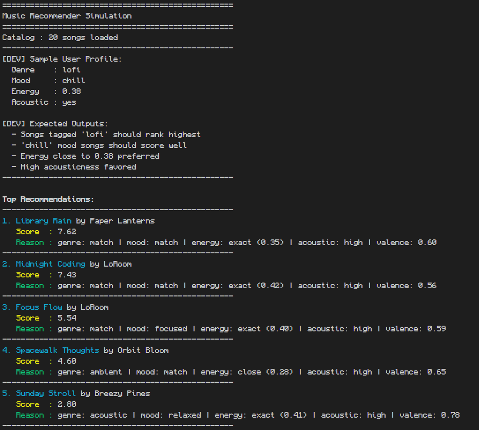

# 🎵 Music Recommender Simulation

## Project Summary

In this project you will build and explain a small music recommender system.

Your goal is to:

- Represent songs and a user "taste profile" as data
- Design a scoring rule that turns that data into recommendations
- Evaluate what your system gets right and wrong
- Reflect on how this mirrors real world AI recommenders

Replace this paragraph with your own summary of what your version does.

---

## How The System Works

From my understanding, real-world recommendations work by finding patterns within multiple users' behavioral data. Users are made a "taste" profile about items they prefer through their behavior. For songs, its about the minutes they spend listening, skips, likes, saves. A user's profile is then compared to another user's who has similar taste and are recommended a "people who like this also liked...". For this to work, songs must be analyzed to recognize the patterns within them as well. Someone may like both classical music and rock, but another may only like rock. Suggesting classical to the latter can disrupt their listening experience.

### Song Features:

- genre
- mood
- energy
- acousticness
- valence

### User Features:

- favorite_genre
- favorite_mood
- target_energy
- likes_acoustic

With the limited amount of data, the user profile will only contain configurations either automatically calculated (determined by their listening data) OR manually set by the user.

### The Recommender

The recommender uses a weighted system that matches a songs features to a user's preference to calculate a final ranking.


The list of songs are ordered by their final scores and the top-k would be recommended

#### Algorithm Recipe

score = 3.0 _ (song.genre == user.favorite_genre) + 2.0 _ (song.mood == user.favorite*mood) + 1.5 * (1 - abs(song.energy - user.target*energy)) + 1.0 * (song.acousticness if user.likes_acoustic else 1 - song.acousticness) + 0.5 \* song.valence

### CLI Output



## Getting Started

### Setup

1. Create a virtual environment (optional but recommended):

   ```bash
   python -m venv .venv
   source .venv/bin/activate      # Mac or Linux
   .venv\Scripts\activate         # Windows

   ```

2. Install dependencies

```bash
pip install -r requirements.txt
```

3. Run the app:

```bash
python -m src.main
```

### Running Tests

Run the starter tests with:

```bash
pytest
```

You can add more tests in `tests/test_recommender.py`.

---

## User Profile Outputs

**rock_user** — genre: rock, mood: intense, energy: 0.90, acoustic: no

Storm Runner is a runaway winner — the only song that hits both genre and mood, giving it a large score gap over 2nd place. The rest of the top 5 fills in with high-energy, low-acousticness songs from other genres, showing how dominant the combined genre+mood weight (5 pts) is.


---

**lofi_user** — genre: lofi, mood: chill, energy: 0.38, acoustic: yes

The two lofi/chill songs (Library Rain, Midnight Coding) lock in the top 2. Focus Flow ranks 3rd despite a mood mismatch because it shares the lofi genre — genre weight alone keeps it ahead of songs with better mood fits. High acousticness also lifts ambient/folk tracks into the lower spots.

**pop_user** — genre: pop, mood: happy, energy: 0.75, acoustic: no

Sunrise City wins cleanly. Gym Hero ranks 2nd even though its mood is "intense" rather than "happy" — the shared pop genre is enough to pull it above songs that match on mood but not genre. Pixel Parade and Rooftop Lights cluster tightly in 3rd/4th using happy mood alone.


---

**jazz_user** — genre: jazz, mood: relaxed, energy: 0.45, acoustic: yes

Coffee Shop Stories is the only jazz/relaxed song, so it wins by a wide margin. After that, the algorithm leans on relaxed mood (Sunday Stroll, Blue Velvet Hours) and high acousticness to fill the remaining slots, pulling from soul and acoustic genres.

**edm_user** — genre: edm, mood: energetic, energy: 0.95, acoustic: no

No EDM songs exist in the catalog, so the genre bonus is zero for every song. The algorithm falls back entirely on mood (energetic) and energy proximity — Club After Dark and Habanera Dreams float to the top purely on "energetic" mood matches. This reveals a catalog gap: a user with a missing genre gets weaker, less personalized results.


---

**sad_fan** _(edge case)_ — genre: folk, mood: melancholic, energy: 0.30, acoustic: yes — tests whether the algorithm unfairly boosts high-valence songs for users who prefer dark/sad music.

**walking_contradiction** _(edge case)_ — genre: metal, mood: relaxed, energy: 0.95, acoustic: yes — every preference conflicts with another; the algorithm silently picks whichever song loses the least.


---

## Experiments You Tried

- What happened when you added tempo or valence to the score
- How did your system behave for different types of users

### Double Energy

By doubling the energy, 4 out of the 7 Users saw a slight shift in their rankings. It did not cause any significant changes that made the ranking more or less inaccurate, just slightly different. Most ranking shifts were 3 <-> 4 or 5 <-> 4 .

### Adding Tempo

Adding tempo to the weighing system

### Halfing Genre Matching

Genre matching provides a flat +3.0 to the score, theoretically affecting rankings significantly. Results ranked after this weight was halfed to 1.5 surprisingly only shifted a few of the rankings, only affecting 3 users and only shifting 1 song significantly in a user's ranking (walking contradiction: Iron & Rust 1 -> 4) .

## Limitations and Risks

### Filter Bubbles

**Binary genre lock-in (highest risk)** — Genre matching is exact and all-or-nothing, with the highest weight (3.0). A genre match adds a flat +3.0 bonus that no combination of energy, acoustics, and valence can overcome (their combined max is only 3.0). Users are almost always shown songs from their stated genre, making cross-genre discovery nearly impossible. Semantically related genres like "indie pop" vs "pop" or "folk" vs "acoustic" get zero credit.

**Binary mood lock-in** — Mood matching works the same way (weight 2.0). A genre + mood double-match gives +5.0, making any song without both uncompetitive. Related moods like "energetic" and "intense" are treated as completely different.

**No diversity enforcement** — The top-k result is a pure score sort. All 5 recommendations can (and often do) collapse into the same genre and mood cluster, with no mechanism to surface variety across artists or sub-genres.

### Biases

**Unconditional valence bonus (biases toward happy music)** — Valence is always added positively (`0.5 × song.valence`) regardless of user preference. There is no `target_valence` field in the user profile. A user who prefers dark or sad music (like `sad_fan`) still has upbeat songs scored higher all else equal. "Hollow Mountains" (the ideal melancholic folk match) scores +0.14 from valence while a pop song with valence 0.90 scores +0.45 — a systematic +0.31 bias against emotionally dark content for every user.

**`danceability` and `tempo_bpm` are ignored** — Both fields are loaded from the CSV and stored but never used in scoring. Users with strong preferences for rhythm or tempo have no way to express that, and the system discards that signal entirely.

**Silent out-of-catalog genre failure** — If a user's `favorite_genre` is not in the catalog (e.g., `edm_user`), genre match is 0 for every song and the system falls back silently to mood and energy with no indication to the user that their genre preference was unserviceable.

**Contradictory preferences fail silently** — A user like `walking_contradiction` (high energy + likes acoustic) has self-conflicting preferences because high-energy songs have very low acousticness in this catalog. The algorithm picks whichever song "loses least" with no feedback to the user that their preferences are in conflict.

---

## Reflection

Read and complete `model_card.md`:

[**Model Card**](model_card.md)

Write 1 to 2 paragraphs here about what you learned:

- about how recommenders turn data into predictions
- about where bias or unfairness could show up in systems like this

---

## 7. `model_card_template.md`

Combines reflection and model card framing from the Module 3 guidance. :contentReference[oaicite:2]{index=2}

```markdown
# 🎧 Model Card - Music Recommender Simulation

## 1. Model Name

Give your recommender a name, for example:

> VibeFinder 1.0

---

## 2. Intended Use

- What is this system trying to do
- Who is it for

Example:

> This model suggests 3 to 5 songs from a small catalog based on a user's preferred genre, mood, and energy level. It is for classroom exploration only, not for real users.

---

## 3. How It Works (Short Explanation)

Describe your scoring logic in plain language.

- What features of each song does it consider
- What information about the user does it use
- How does it turn those into a number

Try to avoid code in this section, treat it like an explanation to a non programmer.

---

## 4. Data

Describe your dataset.

- How many songs are in `data/songs.csv`
- Did you add or remove any songs
- What kinds of genres or moods are represented
- Whose taste does this data mostly reflect

---

## 5. Strengths

Where does your recommender work well

You can think about:

- Situations where the top results "felt right"
- Particular user profiles it served well
- Simplicity or transparency benefits

---

## 6. Limitations and Bias

Where does your recommender struggle

Some prompts:

- Does it ignore some genres or moods
- Does it treat all users as if they have the same taste shape
- Is it biased toward high energy or one genre by default
- How could this be unfair if used in a real product

---

## 7. Evaluation

How did you check your system

Examples:

- You tried multiple user profiles and wrote down whether the results matched your expectations
- You compared your simulation to what a real app like Spotify or YouTube tends to recommend
- You wrote tests for your scoring logic

You do not need a numeric metric, but if you used one, explain what it measures.

---

## 8. Future Work

If you had more time, how would you improve this recommender

Examples:

- Add support for multiple users and "group vibe" recommendations
- Balance diversity of songs instead of always picking the closest match
- Use more features, like tempo ranges or lyric themes

---

## 9. Personal Reflection

A few sentences about what you learned:

- What surprised you about how your system behaved
- How did building this change how you think about real music recommenders
- Where do you think human judgment still matters, even if the model seems "smart"
```
