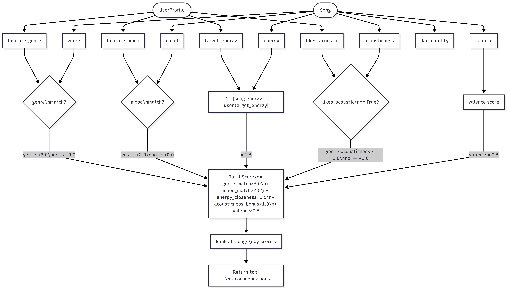
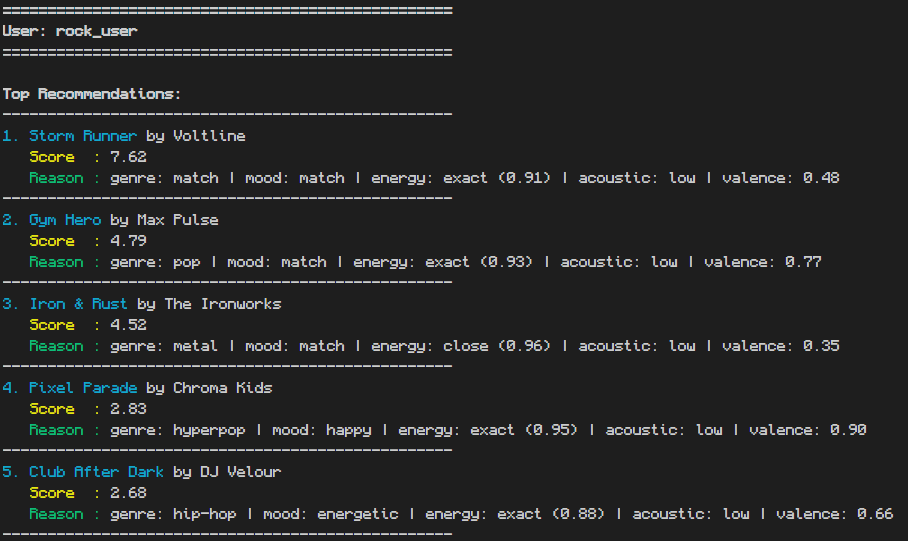
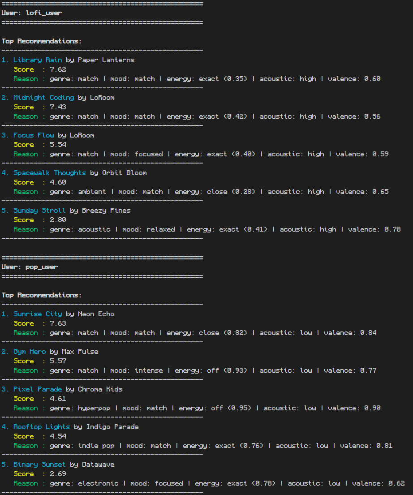
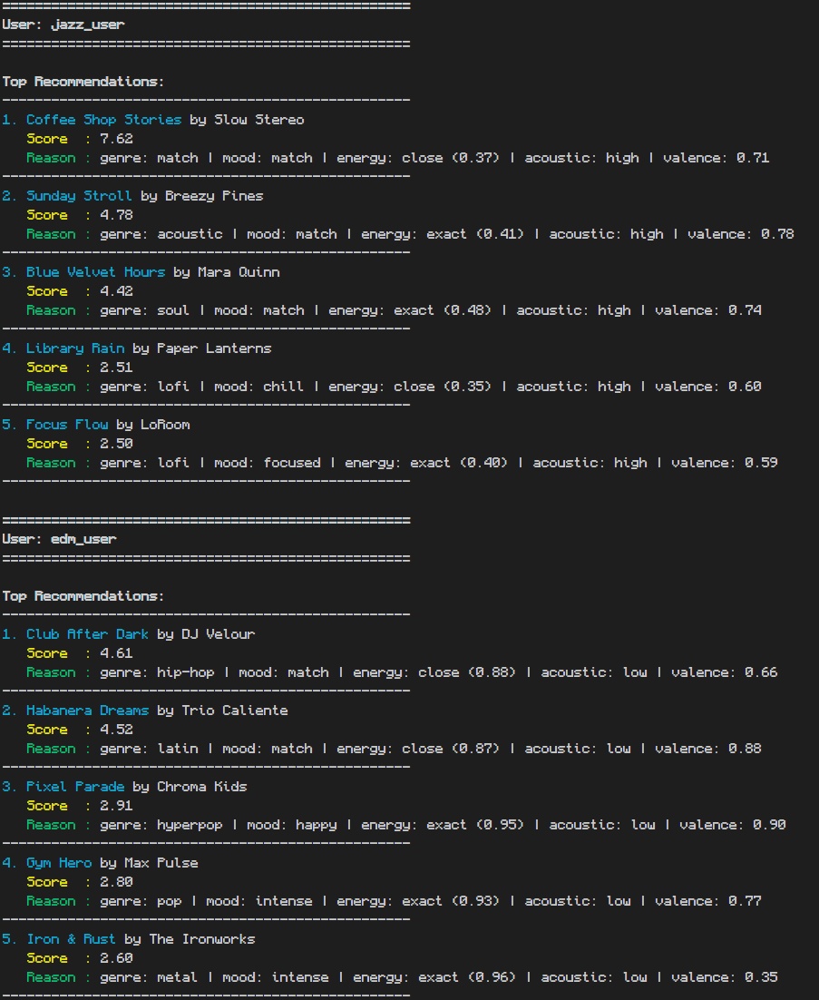
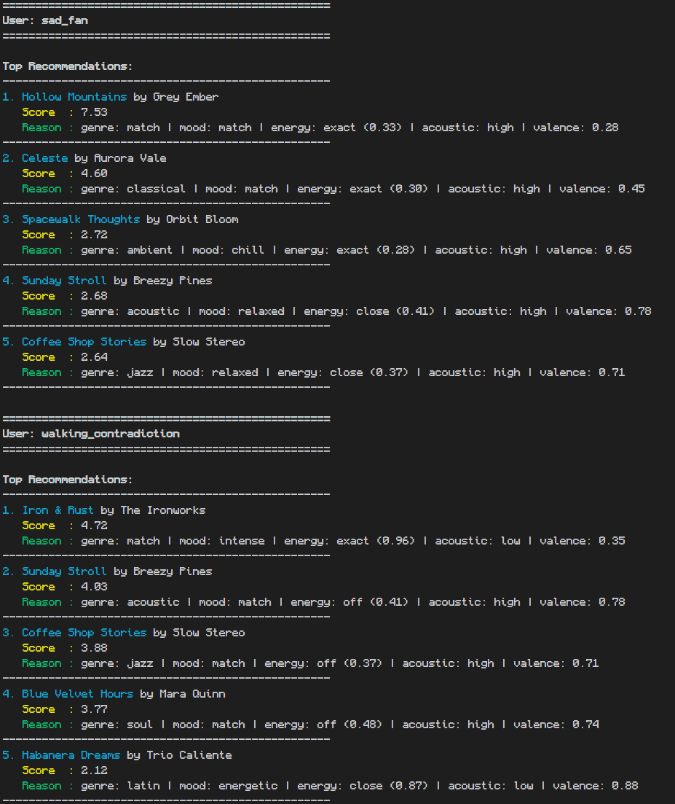

# 🎵 Music Recommender Simulation

## Project Summary

In this project you will build and explain a small music recommender system.

Your goal is to:

- Represent songs and a user "taste profile" as data
- Design a scoring rule that turns that data into recommendations
- Evaluate what your system gets right and wrong
- Reflect on how this mirrors real world AI recommenders

Replace this paragraph with your own summary of what your version does.

---

## How The System Works

From my understanding, real-world recommendations work by finding patterns within multiple users' behavioral data. Users are made a "taste" profile about items they prefer through their behavior. For songs, its about the minutes they spend listening, skips, likes, saves. A user's profile is then compared to another user's who has similar taste and are recommended a "people who like this also liked...". For this to work, songs must be analyzed to recognize the patterns within them as well. Someone may like both classical music and rock, but another may only like rock. Suggesting classical to the latter can disrupt their listening experience.

### Song Features:

| Feature | Type | Description |
|---|---|---|
| `genre` | string | Musical genre (pop, rock, jazz, lofi, etc.) |
| `mood` | string | Emotional mood (happy, chill, intense, melancholic, etc.) |
| `energy` | float 0–1 | Intensity and activity level |
| `acousticness` | float 0–1 | Acoustic vs. electronic character |
| `valence` | float 0–1 | Emotional positivity (0 = dark, 1 = bright) |
| `tempo_bpm` | float | Beats per minute |
| `danceability` | float 0–1 | Rhythmic suitability for dancing |
| `instrumentalness` | float 0–1 | Degree of instrumental vs. vocal content |
| `popularity` | int 0–100 | Popularity score (higher = more mainstream) |
| `year` | int | Release year |

### User Features:

| Feature | Type | Default | Description |
|---|---|---|---|
| `favorite_genre` | string | required | Target genre for matching |
| `mood_weights` | dict | required | Weighted mood preferences, e.g. `{"happy": 0.7, "energetic": 0.3}` |
| `target_energy` | float | required | Preferred energy level (0–1) |
| `likes_acoustic` | bool | required | Preference for acoustic vs. electronic sound |
| `target_valence` | float | `0.5` | Preferred emotional tone (0 = dark, 1 = bright) |
| `prefers_instrumental` | bool | `False` | Rewards high instrumentalness when True |
| `prefers_mainstream` | bool | `False` | Rewards high popularity scores when True |
| `preferred_decade` | int | `2020` | Preferred release era (e.g. 1990, 2010, 2023) |
| `liked_artists` | list | `[]` | Artists the user follows — triggers familiarity bonus |
| `discovery_mode` | bool | `False` | Penalizes known artists to surface new ones |
| `listen_history` | list | `[]` | Song IDs heard recently (oldest → newest) — triggers repeat decay |

With the limited amount of data, the user profile will only contain configurations either automatically calculated (determined by their listening data) OR manually set by the user.

### The Recommender

The recommender uses a weighted system that matches a songs features to a user's preference to calculate a final ranking.



The list of songs are ordered by their final scores and the top-k would be recommended

#### Algorithm Recipe

The score is the weighted sum of 10 components, minus an optional repeat penalty:

```
score = 3.00 × genre_similarity(song.genre, user.favorite_genre)          ← graph-based, 0–1
      + 2.00 × mood_weight_match(song.mood, user.mood_weights)             ← weighted, normalized
      + 1.50 × (1 - |song.energy - user.target_energy|)                   ← linear proximity
      + 1.00 × (song.acousticness if likes_acoustic else 1 - acousticness) ← preference-aware
      + 0.75 × (song.instrumentalness if prefers_instrumental else 1 - instrumentalness)
      + 0.50 × (1 - |song.valence - user.target_valence|)                 ← user-aligned
      + 0.50 × artist_bonus(song.artist, liked_artists, discovery_mode)   ← familiarity/discovery
      + 0.50 × (popularity/100 if prefers_mainstream else 1 - popularity/100)
      + 0.50 × max(0, 1 - |song.year - user.preferred_decade| / 10)       ← era affinity
      − 0.50 / recency_rank   (only if song.id is in user.listen_history)  ← repeat decay
```

**Genre similarity** uses a weighted graph instead of binary matching — adjacent genres like `folk → acoustic` score 0.7 and `rock → metal` score 0.6, giving partial credit instead of zero.

**Mood matching** supports multiple moods with weights (e.g. `{"happy": 0.6, "energetic": 0.4}`), normalized so the combined mood score stays between 0 and 1.

**Repeat decay** subtracts more for more recently heard songs: the most recent song in history loses `0.5`, the second-most-recent loses `0.25`, and so on.

---

### Ranking Strategies

The CLI offers three interchangeable ranking strategies. Each uses the same song catalog and user profile but re-weights the scoring components to answer a different question.

#### 1. Balanced *(default)*

The standard approach — all components contribute proportionally.

```
score = 3.00 × genre_similarity
      + 2.00 × mood_match
      + 1.50 × energy_proximity
      + 1.00 × acousticness_preference
      + 0.75 × instrumentalness_preference
      + 0.50 × valence_proximity
      + 0.50 × artist_bonus / discovery_penalty
      + 0.50 × popularity_preference
      + 0.50 × era_affinity
      − 0.50 / recency_rank
```

Best for users with clearly-defined genre and mood preferences who want well-rounded matches.

#### 2. Vibe Match

Mood, energy, and audio feel dominate — genre labels are a light tiebreaker. Artist familiarity and popularity are ignored entirely.

```
score = 5.00 × mood_match
      + 4.00 × energy_proximity
      + 2.00 × valence_proximity
      + 2.00 × acousticness_preference
      + 0.50 × instrumentalness_preference
      + 0.50 × genre_similarity        ← tiebreaker only
      − 0.50 / recency_rank
```

A pop song and a jazz song with identical energy and mood will score the same — genre doesn't gate them out. Best for "how do I want to feel right now" browsing, or finding cross-genre songs that share a sonic feel.

#### 3. Trend Chaser

Popularity and recency dominate, anchored to 2024. Acousticness, valence, instrumentalness, and artist preferences are ignored.

```
score = 5.00 × (song.popularity / 100)
      + 3.00 × max(0, 1 − |song.year − 2024| / 8)   ← 8-year decay window
      + 1.50 × mood_match
      + 1.00 × energy_proximity
      + 0.75 × genre_similarity
      − 0.50 / recency_rank
```

A well-matched but obscure song will lose to a high-popularity 2023 release. Best for discovering what is currently popular within a mood or energy level.

#### Strategy Comparison

| Component | Balanced | Vibe Match | Trend Chaser |
|---|:---:|:---:|:---:|
| Genre similarity | 3.00 | 0.50 | 0.75 |
| Mood match | 2.00 | 5.00 | 1.50 |
| Energy proximity | 1.50 | 4.00 | 1.00 |
| Valence proximity | 0.50 | 2.00 | — |
| Acousticness | 1.00 | 2.00 | — |
| Instrumentalness | 0.75 | 0.50 | — |
| Artist bonus | 0.50 | — | — |
| Popularity | 0.50 | — | 5.00 |
| Era affinity | 0.50 | — | 3.00 *(anchored to 2024)* |
| Repeat decay | −0.50 | −0.50 | −0.50 |

---

### CLI Output

The CLI is interactive — arrow keys select a user profile and ranking strategy, then results are displayed in a formatted table. Run with:

```bash
python -m src.main
```

## Getting Started

### Setup

1. Create a virtual environment (optional but recommended):

   ```bash
   python -m venv .venv
   source .venv/bin/activate      # Mac or Linux
   .venv\Scripts\activate         # Windows

   ```

2. Install dependencies

```bash
pip install -r requirements.txt
```

3. Run the app:

```bash
python -m src.main
```

### Running Tests

Run the starter tests with:

```bash
pytest
```

You can add more tests in `tests/test_recommender.py`.

---

## User Profile Outputs

**rock_user** — genre: rock, moods: intense, energy: 0.90, acoustic: no

Storm Runner wins by a wide margin — the only song that hits both genre and mood. Iron & Rust (metal) now scores 2nd thanks to the genre similarity graph giving `metal → rock` a 0.6 credit, which was previously zero. Niche popularity scores also benefit this user since they prefer underground rock.



---

**lofi_user** — genre: lofi, moods: chill, energy: 0.38, acoustic: yes, prefers_instrumental: yes

Library Rain and Midnight Coding lock the top 2. With `prefers_instrumental: True`, ambient tracks like Spacewalk Thoughts (instrumentalness: 0.95) climb significantly — they now outscore Focus Flow which has a mood mismatch. The instrumental preference reshapes the lower half of the list toward wordless tracks.

**pop_user** — genre: pop, moods: happy, energy: 0.75, acoustic: no, prefers_mainstream: yes, preferred_decade: 2023

Sunrise City still wins, but now Pixel Parade and Gym Hero climb further because they're both high-popularity (75, 72) and recent (2023). Rooftop Lights (indie pop, 2021) drops slightly despite a genre similarity score of 0.7 — it loses on both popularity and era compared to the newer entries.



---

**jazz_user** — genre: jazz, moods: relaxed, energy: 0.45, acoustic: yes, prefers_instrumental: yes, preferred_decade: 2019

Coffee Shop Stories wins by a large margin — it's the only jazz/relaxed song, released in 2019 (era match), and has moderate instrumentalness (0.30). Blue Velvet Hours (soul) holds 2nd via the `jazz → soul` 0.6 similarity credit. Lofi/ambient tracks appear in 4th/5th because their high instrumentalness compensates for genre mismatch.

**edm_user** — genre: edm, moods: energetic, energy: 0.95, acoustic: no

No EDM songs in the catalog — genre similarity is 0 for every song. The algorithm still falls back on mood and energy. Club After Dark and Habanera Dreams lead on "energetic" mood. This is an unchanged catalog gap: a user with a missing genre gets weaker, less personalized results.



---

**sad_fan** _(edge case)_ — genre: folk, moods: melancholic, energy: 0.30, acoustic: yes, target_valence: 0.25

With `target_valence: 0.25`, the valence scoring now actively rewards dark songs instead of unconditionally adding upbeat valence. Hollow Mountains (valence: 0.28) scores near-perfectly on valence; previously it was penalized relative to brighter songs. Celeste (classical, melancholic) now surfaces as 2nd via the `folk → classical` 0.3 similarity credit.

**walking_contradiction** _(edge case)_ — genre: metal, moods: relaxed, energy: 0.95, acoustic: yes

Every preference still conflicts with another. However, Iron & Rust now earns genre credit (metal = exact match, score: 1.0) and surfaces as the clear #1. The genre similarity graph separates it from the field. The algorithm still picks whichever song loses least overall — the contradiction is not resolved, just reordered.



---

**mixed_mood_user** _(new)_ — genre: pop, moods: happy (0.6) + energetic (0.4), energy: 0.80, acoustic: no

Demonstrates multi-mood tolerance. Sunrise City and Rooftop Lights score on the "happy" weight (0.6); energetic songs like Gym Hero score on the "energetic" weight (0.4). Songs that match neither mood still compete on genre and energy — the partial credit keeps rankings more competitive than a single-mood profile.

**repeat_listener** _(new)_ — genre: lofi, moods: chill, prefers_instrumental: yes, listen_history: [2, 4, 9], liked_artists: [LoRoom, Paper Lanterns]

Demonstrates anti-repetition decay and artist familiarity together. LoRoom and Paper Lanterns get the +0.5 artist bonus but also take the repeat penalty (-0.50 for most recent, -0.25 and -0.17 for older). Library Rain still ranks 1st because its penalty is smaller and the artist bonus more than covers it. Spacewalk Thoughts climbs to 3rd — no familiarity bonus but also no penalty, so repeat-free songs become more competitive.

**discovery_user** _(new)_ — genre: jazz, moods: relaxed (0.7) + chill (0.3), discovery_mode: yes, liked_artists: [Slow Stereo], prefers_mainstream: no

Coffee Shop Stories still ranks 1st despite being by a known artist (Slow Stereo is penalized, not zeroed). Blue Velvet Hours jumps to 2nd, earning both the discovery bonus (+0.3) and the `jazz → soul` similarity credit. Niche songs gain an additional edge from `prefers_mainstream: False`, pulling lesser-known tracks ahead of higher-charting ones.

---

## Experiments You Tried

- What happened when you added tempo or valence to the score
- How did your system behave for different types of users

### Double Energy

By doubling the energy, 4 out of the 7 Users saw a slight shift in their rankings. It did not cause any significant changes that made the ranking more or less inaccurate, just slightly different. Most ranking shifts were 3 <-> 4 or 5 <-> 4 .

### Adding Tempo

Adding tempo to the weighing system

### Halfing Genre Matching

Genre matching provides a flat +3.0 to the score, theoretically affecting rankings significantly. Results ranked after this weight was halfed to 1.5 surprisingly only shifted a few of the rankings, only affecting 3 users and only shifting 1 song significantly in a user's ranking (walking contradiction: Iron & Rust 1 -> 4) .

## Limitations and Risks

### Filter Bubbles

**Genre still dominates** — Even with the similarity graph, genre carries the highest weight (3.0). An exact genre match still adds a +3.0 bonus that mood + energy alone cannot fully overcome. Cross-genre discovery is more possible than before (via partial credit) but the system still strongly favors the user's stated genre.

**No diversity enforcement** — The top-k result is a pure score sort. All 5 recommendations can still collapse into the same genre/mood cluster. There is no mechanism to enforce artist or genre variety across the final list.

**Out-of-catalog genre falls back silently** — If a user's `favorite_genre` has no exact or adjacent match in the catalog (e.g., `edm_user`), all genre scores are 0 and the system falls back to mood and energy with no user-facing message.

### Biases

**`danceability` and `tempo_bpm` are still unused** — Both fields are loaded from the CSV but never scored. Users with strong rhythm or tempo preferences have no way to express that signal.

**Contradictory preferences fail silently** — A user like `walking_contradiction` (high energy + likes acoustic) has self-conflicting preferences because high-energy songs have very low acousticness in this catalog. The algorithm picks whichever song "loses least" with no feedback to the user.

**Popularity and era signals are symmetric but uncalibrated** — `WEIGHT_POPULARITY` and `WEIGHT_ERA` are set to 0.5 each, meaning a perfectly niche or perfectly mainstream song can swing the score by ±0.5. In catalogs where many songs cluster in the same era or popularity band, these attributes may add little differentiation.

### Fixed in this version

| Previously a bias | How it was addressed |
|---|---|
| Binary genre lock-in | Genre similarity graph — partial credit for adjacent genres (0.3–0.7) |
| Binary mood lock-in | Multi-mood `mood_weights` dict — normalized weighted match |
| Unconditional valence boost | `target_valence` in user profile — valence now scored as proximity |
| No repeat awareness | `listen_history` + recency-weighted decay penalty |
| No artist personalization | `liked_artists` bonus and `discovery_mode` penalty |

---

## Reflection

Read and complete `model_card.md`:

[**Model Card**](model_card.md)

Write 1 to 2 paragraphs here about what you learned:

- about how recommenders turn data into predictions
- about where bias or unfairness could show up in systems like this

---

## 7. `model_card_template.md`

Combines reflection and model card framing from the Module 3 guidance. :contentReference[oaicite:2]{index=2}

```markdown
# 🎧 Model Card - Music Recommender Simulation

## 1. Model Name

Give your recommender a name, for example:

> VibeFinder 1.0

---

## 2. Intended Use

- What is this system trying to do
- Who is it for

Example:

> This model suggests 3 to 5 songs from a small catalog based on a user's preferred genre, mood, and energy level. It is for classroom exploration only, not for real users.

---

## 3. How It Works (Short Explanation)

Describe your scoring logic in plain language.

- What features of each song does it consider
- What information about the user does it use
- How does it turn those into a number

Try to avoid code in this section, treat it like an explanation to a non programmer.

---

## 4. Data

Describe your dataset.

- How many songs are in `data/songs.csv`
- Did you add or remove any songs
- What kinds of genres or moods are represented
- Whose taste does this data mostly reflect

---

## 5. Strengths

Where does your recommender work well

You can think about:

- Situations where the top results "felt right"
- Particular user profiles it served well
- Simplicity or transparency benefits

---

## 6. Limitations and Bias

Where does your recommender struggle

Some prompts:

- Does it ignore some genres or moods
- Does it treat all users as if they have the same taste shape
- Is it biased toward high energy or one genre by default
- How could this be unfair if used in a real product

---

## 7. Evaluation

How did you check your system

Examples:

- You tried multiple user profiles and wrote down whether the results matched your expectations
- You compared your simulation to what a real app like Spotify or YouTube tends to recommend
- You wrote tests for your scoring logic

You do not need a numeric metric, but if you used one, explain what it measures.

---

## 8. Future Work

If you had more time, how would you improve this recommender

Examples:

- Add support for multiple users and "group vibe" recommendations
- Balance diversity of songs instead of always picking the closest match
- Use more features, like tempo ranges or lyric themes

---

## 9. Personal Reflection

A few sentences about what you learned:

- What surprised you about how your system behaved
- How did building this change how you think about real music recommenders
- Where do you think human judgment still matters, even if the model seems "smart"
```
